# Laravel Backend Performance & Scalability API

<!-- #region  Presentation -->

*A backend engineering project built with Laravel, focused on performance, scalability, and real-world architectural decisions commonly found in production-grade systems.*


---

This project demonstrates how to design and optimize API-driven applications using:

- Query optimization and database-level aggregation
- Laravel Sanctum authentication for secure API access
- Asynchronous processing with queued jobs (emails)
- High-performance report generation (Eloquent vs Query Builder analysis)

>Built to demonstrate backend engineering capabilities with a strong focus on performance, scalability, and system design decisions expected in modern production APIs.

<!-- #endregion -->

---

<!-- #region Tech_stack-->

## 🛠 Tech Stack

- PHP 8.3
- Laravel 11+
- MySQL (Query Optimization & Aggregations)
- Laravel Sanctum (API Authentication)
- Laravel Queues (Asynchronous Processing)
- Laravel Debugbar / Logging (Performance Analysis & Profiling)
- Postman (API Testing & Validation)

<!-- #endregion -->

## D.S (Demonstration Scenario)

<!-- ================================================================ -->
<!-- D.S_1 ========================================================== -->

<!-- #region D.S_1 -->

<!-- #region Query_prblem_and_eager_loading -->
<details>
    <summary> <b> D.S 1 - N + 1 Query problem and Eager loading optimization </b> </summary>
<br>

**Using API Resources without eager loading can silently introduce the N+1 query problem, leading to inefficient database usage and scalability issues.**

<details>
    <summary> <b> ➡️ Lets use Sales API endpoint as example </b> </summary>
<br>

The system exposes a Sales API endpoint, where each Sale is related to a Client.

Each SaleResource includes client information:

*app/Http/Resources/Api/V1/Sale/SaleResource.php*

```bash
'client' => [
    'id' => $this->client->id,
    'name' => $this->client->name,
],

```
</details>

<!-- #endregion -->

<br>

<!-- #region Scenario_1 -->

<details>
    <summary> <b> ❌ SCENARIO 1 - Lazy Loading (N + 1 Problem) </b> </summary>
<br>
Implementation

*app/Services/SaleService.php*

```bash
return Sale::latest()->paginate(10);
```

Behavior

- When the SaleResource accesses: $this->client
- Laravel resolves the relationship using lazy loading, executing additional queries per item.

Query Breakdown
    
- 1 query → fetch sales
- N queries → fetch clients (one per sale)

Problem

- This approach introduces a linear growth in database queries (O(n)), which results in:
    - unnecessary database load;
    - poor scalability under high data volume;
    - hidden performance issues inside serialization layer;
</details>

<!-- #endregion -->

<br>

<!-- #region Scenario_2 -->

<details>
    <summary> <b> ✅ SCENARIO 2 - Optimized Solution (Eager Loading) </b> </summary>
<br>

Implementation 

*app/Models/Sale.php*

```bash
public function client()
{
    return $this->belongsTo(Client::class);
}
```

*app/Services/SaleService.php*

```bash
return Sale::with('client')->latest()->paginate(10);
```

Behavior

- All required relationships are loaded in advance using eager loading, avoiding additional queries during serialization.

Query Breakdown

- 1 query → fetch sales
- 1 query → fetch clients

Result

- This approach reduces relationship query complexity from:   O(n) → O(1)
ensuring predictable performance regardless of dataset size.

</details>

<!-- #endregion -->

<br>

<!-- #region Debugbar_evidence -->

<details>
    <summary> <b> ➡️ Debugbar evidence - Screenshots </b> </summary>
<br>

- Lazy Test

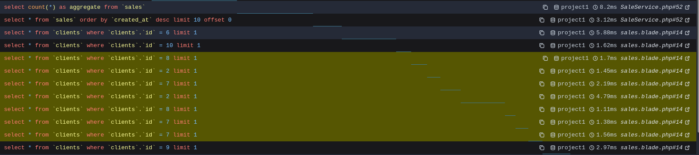

*Repeated queries to the clients table confirm the N+1 issue caused by lazy loading.*

- Eager Test

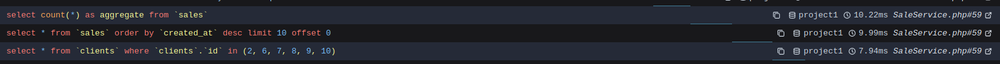

*As shown in Debugbar, query count remains constant regardless of dataset size, improving scalability and reducing unnecessary database load.*

</details>

<!-- #endregion -->

<br>

<!-- #region Key_insight -->

<details>
    <summary> <b> ➡️ Key insight <b> </summary>

While execution time differences may be minimal in small datasets, the real impact of eager loading is not latency reduction, but query scalability and database load control.

</details>

</details>

<!-- #endregion -->

<!-- #endregion -->

<!-- D.S_1 ========================================================== -->
<!-- ================================================================ -->

---

<!-- ================================================================ -->
<!-- D.S 2 ========================================================== -->

<!-- #region D.S_2 -->

<!-- #region Aggregate_query_optimization -->
<details>
    <summary> <b> D.S 2 - Aggregate Query Optimization (SUM + Loop vs Single SQL Update) </b> </summary>
<br>


<details>
    <summary> <b> Lets use database/seeders/DatabaseSeeder.php as example: </b> </summary>
<br>
Each Client stores a total_spent field, representing the total amount of all related sales.
This value needs to be recalculated after generating seed data for benchmark scenarios.

- The relationship is:

```bash
Client → hasMany → Sales;
```
*The goal is to update total_spent efficiently for all clients.*

</details>

<!-- #endregion -->

<br>

<!-- #region Scenario_1 -->

<details>
    <summary> <b> ❌ SCENARIO 1 - Aggregate Query Inside Loop </b> </summary>
<br>

Implementation

```bash
Client::all()->each(function ($client) {
    $client->update([
        'total_spent' => $client->sales()->sum('total_amount')
    ]);
});
```

Behavior

- For each client, Laravel executes:

```sql
SELECT SUM(total_amount)
FROM sales
WHERE client_id = ?
```
*This creates an aggregate query per client.*

Query Breakdown

- 1 query → fetch all clients
- N queries → calculate SUM per client
- N queries → update each client

Problem

- This introduces an N+1 pattern in aggregate operations, resulting in:
    - excessive database round trips;
    - poor scalability;
    - slower seed execution;
    - unnecessary load for recalculated fields;

</details>

<!-- #endregion -->

<br>

<!-- #region Scenario_2 -->

<details>
    <summary> <b> ✅ SCENARIO 2 - Single SQL Update with Subquery </b> </summary>
<br>

Implementation

```sql
Client::query()->update([
    'total_spent' => DB::raw("(
        SELECT COALESCE(SUM(total_amount), 0)
        FROM sales
        WHERE sales.client_id = clients.id
    )")
]);
```

Behavior

- The database performs the full aggregation internally using a single SQL statement.
- No per-client loop is required.

Query Breakdown
- 1 query → update all clients

Result

- This approach reduces query complexity from: O(n) → O(1) and significantly improves scalability for large datasets.

</details>

<!-- #endregion -->

<br>

<!-- #region Key_insight -->

<details>
    <summary> <b> Key Insight </b> </summary>
<br>

Even aggregate operations like SUM() can create N+1-style performance problems when executed inside loops.
Performance optimization is not only about relationships (with()), but also about how aggregate calculations are executed

</details>

</details>

<!-- #endregion -->

<!-- #endregion -->

<!-- D.S 2 ========================================================== -->
<!-- ================================================================ -->

---

<!-- ================================================================ -->
<!-- D.S 3 ========================================================== -->

<!-- #region D.S_3 -->

<!-- #region Secure_api_authentication -->

<details>
    <summary> <b> D.S 3 Secure API Authentication with Laravel Sanctum </b> </summary>
<br>

**This project is a modular Business API composed of independent domains such as Clients, Sales and others**
> Because these modules expose protected business operations, authentication must happen before any controller logic is executed.

<!-- #endregion -->

<br>

<!-- #region understanding_how_a_request_travels -->

<details>
    <summary> <b> 📌 Understanding how a request travels inside Laravel </b> </summary>
<br>

When a client sends a request to a protected endpoint such as /api/clients

1. Entry Point (public/index.php) and Application Bootstrap — bootstrap/app.php
    - Every HTTP request starts in public/index.php, the main entry point of the Laravel application.
    - Here, the framework is bootstrapped and the application lifecycle begins.
    - Laravel initializes the service container, loads service providers, and registers middleware.
    - At this stage, authentication services such as Sanctum are prepared to participate in the request pipeline.

2. Route Resolution — routes/api.php
    - Laravel checks the API route definitions and determines whether the requested endpoint requires authentication.
    - Protected routes are grouped using middleware(auth:sanctum).
    - At this moment, Laravel knows the request must be validated by Sanctum before reaching the controller.

3. Authentication Layer — auth:sanctum
    - This is where Sanctum enters the request lifecycle.
    - The middleware validates:
        - if a Bearer token exists
        - if the token is valid
        - if the token belongs to an authenticated user
        - if the token is still authorized to access the resource
    - Laravel Sanctum supports this token-based flow for API authentication by issuing personal access tokens through methods like createToken().
    - If validation fails, Laravel immediately returns '401 Unauthorized' the controller is never executed.

4. Controller Execution
    - Only authenticated requests reach the business layer: ClientController, SalesController and others.
    - This keeps authentication separated from domain logic, improving maintainability and preserving clean architecture principles.

**Why This Design Matters**

- Instead of validating authentication manually inside controllers, this project uses Laravel’s middleware pipeline to enforce security at the framework level.
- This provides:
    - centralized access control;
    - cleaner controllers;
    - stateless API security;
    - easier scalability;
    - stronger architectural consistency;

</details>

<!-- #endregion -->

<br>

<!-- #region How_sanctum_authenticates -->

<details>
    <summary><b> 📌 How Sanctum authenticates requests </b></summary>
<br>

Authentication starts during the login process.

When valid credentials are submitted, Laravel authenticates the user using:

-   *app/Http/Controllers/Api/V1/Auth/AuthController.php*
    ```bash
        public function login(Request $request)
        {
            ...
            if (!Auth::attempt($credentials)) {
                return response()->json([
                    'message' => 'Invalid credentials'
                ], 401);
            }
            $user = $request->user();
            $token = $user->createToken('api-token')->plainTextToken;
            ...
        }
    ```
    - At this point, Laravel Sanctum generates a Personal Access Token associated with the authenticated user
    - This token is returned to the client and must be included in all subsequent requests using: Authorization: Bearer {token}

**What happens next**

When the client accesses a protected route such as GET api/clients
-   *routes/api.php*
    ```bash
        ...
        Route::middleware('auth:sanctum')->group(function () {
            Route::apiResource('clients', ClientController::class);
        ...
    ``` 
    - Laravel checks the Bearer token through: auth:sanctum
        - If the token is valid, the request reaches the controller.
        - If not **401 Unauthorized** is returned immediately.

</details>

<!-- #endregion -->

<br>

<!-- #region How_long_a_token_lasts -->

<details>
    <summary> <b> 📌 How long a token lasts </b> </summary>
<br>

The sanctum token expiration can be centrally managed through config/sanctum.php
    
-   *config/sanctum.php*
    ```bash
    'expiration' => null,
    ```
    - The value null can be replced by the number of minutes until an issued token will be considered expired.

    - ⚠️ Without expiration configuration, Sanctum tokens remain valid indefinitely unless explicitly revoked.

        - When a user logs in, they receive a token:
            ```Json
            {
                "token": "abc123..."
            }
            ```
        - The request continues to work with the same token for days, weeks, or even months.
            ```bash
                Authorization: Bearer abc123...
            ```    
        - This token could be accidentally leaked;
        - The user's laptop could be stolen;
        > the risk of this token being used for malicious purposes is much higher if it never expires.
        
        ❌ The token never expires:
        *config/sanctum.php*
        ```bash
            'expiration' => null,
        ```
        
        ✅ The token lasts 24 hours:
        *config/sanctum.php*
        ```php
            'expiration' => 1440, 
        ```

        **POSTMAN TEST EVIDENCE**
        - Request with valid token

        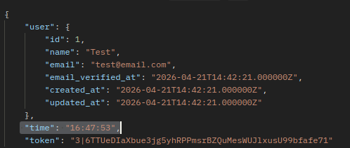
        
        *Token created at: 16:47:53*

        - Http Request with expired token (expiration => 1)
        
        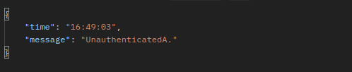
        
        *Protected endpoint requested at: 16:49:03*

</details>

<!-- #endregion -->

<br>

<!-- #region How_to_invalidate_a_token -->

<details>
    <summary> <b> 📌 How to invalidate a token </b> </summary>
<br>

The logout operations revoke tokens directly from the database.

-   *app/Http/Controllers/Api/V1/Auth/AuthController.php*
    ```bash
        ...
        public function logout(Request $request)
        {
            $request->user()->currentAccessToken()->delete();
            return response()->json([
                'message' => 'Logged out'
            ]);
        }
        ...
    ```

</details>

</details>

<!-- #endregion -->

<!-- #endregion -->

<!-- D.S 3 ========================================================== -->
<!-- ================================================================ -->

---

<!-- ================================================================ -->
<!-- D.S 4 ========================================================== -->

<!-- #region D.S_4 -->

<!-- #region Asynchronous_Job_Execution_with_Laravel_Queues -->

<details>
    <summary> <b> D.S 4 Comparing synchronous email sending vs queued job processing in Laravel. </b> </summary>
<br>

**Why moving email sending from synchronous execution to queued jobs improves performance, scalability, and user experience in Laravel applications.**

<!-- #endregion -->

<br>

<!-- #region Synchronous_Execution -->

<details>
    <summary> <b> ❌ Non-recommended Approach (Synchronous Execution) </b> </summary>
<br>

- Email sent directly inside Controller
- Request waits for SMTP response
- High latency on user action
- Tight coupling between business logic and infrastructure
- Example:
    - SaleCreated → SendSaleConfirmationEmail executed immediately

</details>

<!-- #endregion -->

<br>

<!-- #region Queued_job -->

<details>
    <summary> <b> ✅ Recommended Approach (Queued Job Execution) </b> </summary>
<br>

- Dispatch Job: SendSaleConfirmationEmailJob
- Job handled by queue worker (Redis/Database)
- Non-blocking request lifecycle
- Improved performance and scalability
- Flow:
    - SaleCreated
        → Event triggered
        → Listener dispatches Job
        → Queue Worker processes email asynchronously

</details>

<!-- #endregion -->

<br>

<!-- #region Laravel_log_evidencces -->

<details>
    <summary> <b> ➡️ Proof of Execution - Screenshots </b> </summary>
<br>

<!-- #region time_of_execution -->

<details>
    <summary> <b> Time of Execution </b> </summary>
<br>

- Sync Email Test

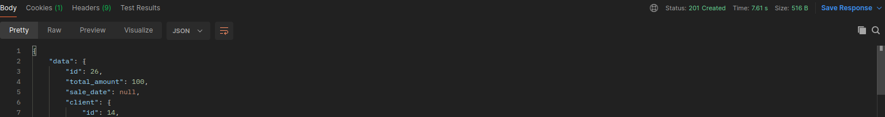

*Everything happens within the same request.*

- Async Email Test

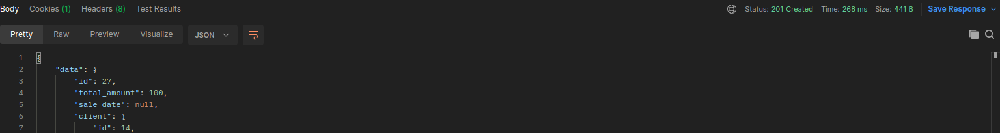

*Business logic fully decoupled from HTTP layer.*

</details>

<!-- #endregion -->

<!-- #region request_fow -->

<details>
    <summary> <b> Request flow </b> </summary>
<br>

- The request lifecycle is blocked until email is sent.

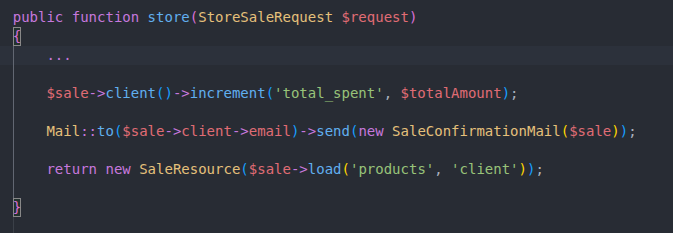

*Synchronous execution happening within the request.*

- Request lifecycle remains non-blocking.

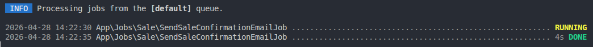

*Job processed asynchronously via queue worker.*

</details>

<!-- #endregion -->

</details>


<!-- #endregion -->

<br>

<!-- #region Key_insight -->

<details>
    <summary> <b> ➡️ Key insight <b> </summary>

Controller → SaleService → SaleCreated Event → Listener → Job (SendSaleConfirmationEmailJob) → Queue Worker

</details>

</details> 

<!-- #endregion -->

<!-- #endregion -->

<!-- D.S 4 ========================================================== -->
<!-- ================================================================ -->

---

<!-- ================================================================ -->
<!-- D.S 5 ========================================================== -->

<!-- #region D.S_5 -->

<!-- #region report_generation_optimization -->

<details>
    <summary> <b> D.S 5 Where Query Builder is often superior to Eloquent. </b> </summary>

<br>

**📌 General Rule:**

- Eloquent for business rules
- Query Builder for reporting and analytics

<!-- #endregion -->

<br>

<!-- #region report_1 -->

<details>
    <summary> <b> REPORT 1 → SALES SUMMARY REPORT. </b> </summary>

<br>

<!-- #region report_1_eloquent -->

<details>
    <summary>❌ Using Eloquent </summary>

<br>

*Eloquent (high-level abstraction) 'app/Services/ReportService.php'*

```php
Sale::with(['client', 'products'])
    ->whereBetween('created_at', [$start, $end])
    ->get();
```

➡️ Laravel Logs Evidence

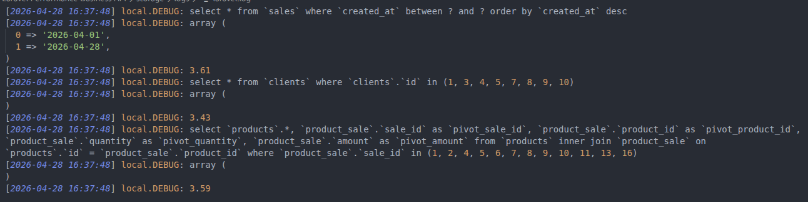

</details>

<!-- #endregion -->

<br>

<!-- #region report_1_query_builder -->

<details>
    <summary> ✅ Using Query Builder </summary>

<br>

*Query Builder (database-level aggregation) 'app/Services/ReportService.php'*

```php
DB::table('sales')
    ->join('clients', 'sales.client_id', '=', 'clients.id')
    ->join('product_sale', 'sales.id', '=', 'product_sale.sale_id')
    ->select(
        'sales.id',
        'clients.name',
        DB::raw('COUNT(product_sale.id) as total_items')
    )
    ->groupBy('sales.id', 'clients.name');
```

➡️ Laravel Logs Evidence

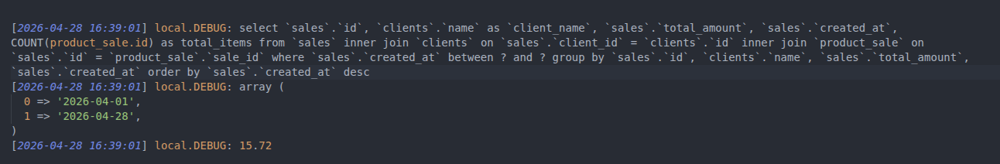

</details>

<!-- #endregion -->

</details>

<!-- #endregion -->

<br>

<!-- #region report_2 -->

<details>
    <summary> <b> REPORT 2  → TOP SELLING PRODUCTS REPORT. </b> </summary>

<br>

💡 Important!
 
- While Query Builder executed a heavier aggregated SQL query, it reduced application-side processing by eliminating model hydration and relationship traversal
- Eloquent distributed the workload across multiple queries and PHP processing, increasing application overhead despite lower individual query latency.

<!-- #region report_2_eloquent -->

<details>
    <summary> ❌ Using Eloquent </summary>

<br>

*app/Services/ReportService.php*

```php
Product::with('sales')
    ->get();
```

➡️ Laravel Logs Evidence

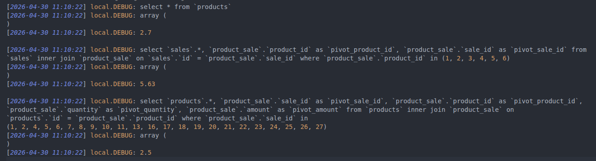

3 queries executed
- products
- sales (pivot join)
- products (pivot join again)

Total: multiple hydration cycles

</details>

<!-- #endregion -->

<br>

<!-- #region report_2_query_builder -->

<details>
    <summary> ✅ Using Query Builder </summary>

<br>

*app/Services/ReportService.php*

```php
DB::table('product_sale')
    ->join('products', 'product_sale.product_id', '=', 'products.id')
    ->select(
        'products.name',
        DB::raw('SUM(product_sale.quantity) as total_sold'),
        DB::raw('SUM(product_sale.amount) as total_revenue')
    )
    ->groupBy('products.name');
```

➡️ Laravel Logs Evidence

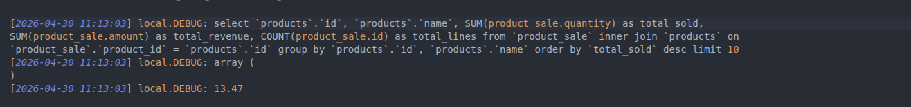

1 query executed
- JOIN + GROUP BY + SUM + COUNT

All aggregation handled at database level

</details>

<!-- #endregion -->

</details>

<!-- #endregion -->

<br>

<!-- #region key_insight -->

<details>
    <summary> <b> ➡️ Key insight <b> </summary>

<br>

Eloquent is optimized for domain modeling, while Query Builder is better suited for analytical workloads. 
By delegating aggregation logic to the database layer, we reduce PHP-side processing, minimize memory usage, and improve scalability for reporting scenarios.

</details>


</details>

<!-- #endregion -->

<!-- #endregion -->

<!-- D.S 5 ========================================================== -->
<!-- ================================================================ -->


